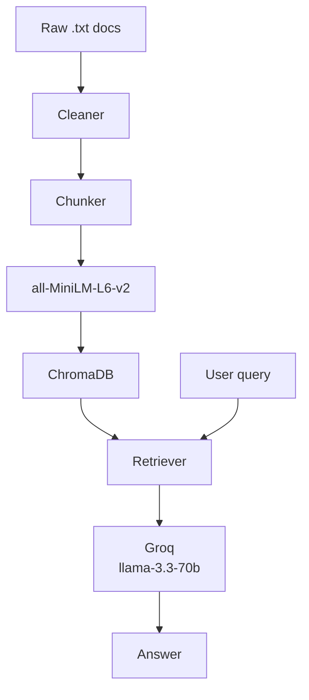

# Project 1 Planning: The Unofficial Guide

> Write this document before you write any pipeline code.
> Your spec and architecture diagram are what you'll use to direct AI tools (Claude, Copilot, etc.) to generate your implementation — the more specific they are, the more useful the generated code will be.
> Update the Retrieval Approach and Chunking Strategy sections if you change your approach during implementation.
> Update this file before starting any stretch features.

---

## Domain

<!-- What domain did you choose? Why is this knowledge valuable and hard to find through official channels? -->
I chose Campus dining experiences at my school (Lehigh University). This knowledge is hard to find through official channels because even though Lehigh's dining website tells you hours and locations. It won't tell you specific information such as if a certain station in the main dining hall always has long wait time on weekday mornings, or that students on the unlimited meal plan actually save money eating off-campus on weekends.

---

## Documents

<!-- List your specific sources: URLs, subreddit names, forum threads, or file descriptions.
     Aim for at least 10 sources that together cover different subtopics or perspectives within your domain. -->

| # | Source | Description | URL or location |
|---|--------|-------------|-----------------|
| 1 | Reddit | Student reviews of Food at Lehigh | https://www.reddit.com/r/Lehigh/comments/1k8v2ru/food_for_incoming_freshmen/ |
| 2 | Yelp | Reviews of Rathbone (Main dining hall) Food | https://www.yelp.com/biz/rathbone-bethlehem |
| 3 | Lehigh Sodexo | Lehigh's Official Dinning website | https://lehigh.sodexomyway.com/en-us/locations/ |
| 4 | Brown and White | University Article on Meal plan and dining changes | https://thebrownandwhite.com/2025/09/12/meal-plan-and-dining-changes-cause-mixed-student-reactions/ |
| 5 | Reddit |Addional Student reviews | https://www.reddit.com/r/Lehigh/comments/uwg358/how_is_the_dining_hall_food_at_lehigh/ |
| 6 | Lehigh Offical Blog Website | A student's Favorite Restaurants in Bethlehem, Pa  | https://blog.lehigh.edu/a-foodies-5-favorite-restaurants-in-bethlehem-pa |
| 7 | Lehigh PDF Dietiation Guide | Detailed overview on Dining with Dietary Restrictions | .documents/dietary_restrictions.pdf |
| 8 | Lehigh Sodexo | Meal Plan Options  | https://lehigh.sodexomyway.com/en-us/meal-plan/meal-plan-options|
| 9 | Yelp | Resturant reviews near Lehigh| https://www.yelp.com/search?find_near=lehigh-university-bethlehem&l=g%3A-75.37010279846594%2C40.617429838019575%2C-75.38307364189582%2C40.60568241189106 |
| 10 | Reddit | Student Food reviews | https://www.reddit.com/r/Lehigh/comments/g83s2n/food_at_lehigh/ |

---

## Chunking Strategy

<!-- How will you split documents into chunks?
     State your chunk size (in tokens or characters), overlap size, and explain why those
     numbers fit the structure of your documents.
     A review-heavy corpus warrants different chunking than a long FAQ. -->

**Chunk size:** ~200-250 tokens would allow us to carry enough semantic meaning

**Overlap:** ~50 tokens would give a good amount of information to carry semantic context

**Reasoning:** We'll overlap with 50 tokens rather than hard cuts to preserve meaning. For one student reviews and forum posts tend to be short, punchy, and topic-specific. Smaller chunks match that grain. Overlap ensures a sentence that straddles a boundary isn't lost.

---

## Retrieval Approach

<!-- Which embedding model are you using (e.g., all-MiniLM-L6-v2 via sentence-transformers)?
     How many chunks will you retrieve per query (top-k)?
     If you were deploying this for real users and cost wasn't a constraint, what tradeoffs
     would you weigh in choosing a different embedding model — context length, multilingual
     support, accuracy on domain-specific text, latency? -->

**Embedding model:** all-MiniLM-L6-v2 via sentence-transformers ( runs fully locally with no API key or cost)

**Top-k:**  4 - 6 Chunks. Too few risks missing a relevant chunk and too many floods the LLM with noisy context

**Production tradeoff reflection:**
With no cost constraint I'd weigh the context length, domain accuracy, multilingual support, and latency. The model I chose (all-MiniLM-L6-v2) caps at 256 tokens, so longer documents get truncated. Thus a different model might support thousands of tokens which would handle richer source material better. Also a students writing may be informal and slang heavy so a model fine-tuned on that would retrieve more precisely. Additionally, a real campus tool likely need to serve non-English speakers, where a multilingual model would be the better fit. Lastly local models return embeddings instantly while cloud API models add network round-trip time on every query, which matters at scale.

---

## Evaluation Plan

<!-- List your 5 test questions with their expected correct answers.
     Questions should be specific enough that you can judge whether the system's response
     is right or wrong. "What are good dining halls?" is too vague.
     "What do students say about wait times at [dining hall name] during lunch?" is testable. -->

| # | Question | Expected answer |
|---|----------|-----------------|
| 1 | How do students describe the quality of food at Lehigh dining halls compared to off-campus alternatives?  | Students are pretty dissapointed with the food at Lehigh. Rathbone is typically a hit or miss but there are a vareity of options avaliable |
| 2 | What food allergies or dietary accommodations do students say Lehigh dining handles well or poorly?  | Students report vegan options are avaliable at Rathbone such as Simple Servings which use ingredients that do not contain milk, eggs, wheat, soy, shellfish, peanuts, tree nuts, sesame, or gluten  |
| 3 | How long are the wait times at Hawks Nest for Lunch if I order French Fries | It is not uncommon to wait 40 minutes for an order of French fries |
| 4 | What changes has Lehigh made to the meal plans and how do students feel about it? | Lehigh cut meal plan options from eight to six and got rid of swapping swipes for dining dollars, replacing it with meal exchanges and more dining dollars in some plans. Students are kind of mixed on it, with some saying it feels less flexible and harder to budget, especially with dining dollars running out faster. |
| 5 | Where can I find some good local Chinese Food around Lehigh? | If you're in the mood for spicy and flavorful Chinese food, I'd recommend ShangWei Szechuan |

---

## Anticipated Challenges

<!-- What could go wrong? Name at least two specific risks with reasoning.
     Consider: noisy or inconsistent documents, missing source attribution, off-topic
     retrieval, chunks that split key information across boundaries. -->

1. Student reviews use slang and casual phrasing ("waited forever," "not worth it," "mid food") while queries are phrased more formally. The embedding model may not bridge that gap well, causing relevant chunks to rank lower than they should. For example a query like "what are wait times at Hawks Nest" might miss a review that says "stood there forever just for fries."

2. Some questions like Q4 (meal plan changes) may have their full answer scattered across several different posts rather than concentrated in one chunk. If the most relevant pieces land in different chunks and only some get retrieved in the top-k, the LLM will produce a partially correct or incomplete answer with no way to know what it missed.
---

## Architecture

<!-- Draw a diagram of your pipeline showing the five stages:
     Document Ingestion → Chunking → Embedding + Vector Store → Retrieval → Generation
     Label each stage with the tool or library you're using.
     You can use ASCII art, a Mermaid diagram, or embed a sketch as an image.
     You'll use this diagram as context when prompting AI tools to implement each stage. -->

---

## AI Tool Plan

<!-- For each part of the pipeline below, describe:
     - Which AI tool you plan to use (Claude, Copilot, ChatGPT, etc.)
     - What you'll give it as input (which sections of this planning.md, which requirements)
     - What you expect it to produce
     - How you'll verify the output matches your spec

     "I'll use AI to help me code" is not a plan.
     "I'll give Claude my Chunking Strategy section and ask it to implement chunk_text()
     with my specified chunk size and overlap" is a plan. -->

**Milestone 3 — Ingestion and chunking:**

- **Tool:** Claude
- **Input:** The "Document Ingestion Pipeline" and "Chunking Strategy" sections
  of this planning.md
- **Expected output:** Two functions — `clean_text(raw: str) -> str` that strips
  whitespace artifacts and blank lines, and `chunk_text(text: str, chunk_size: int,
  overlap: int) -> list[str]` that splits on sentence/paragraph boundaries with
  200–250 word chunks and 30–40 word overlap
- **Verification:** Run both functions on one raw .txt file and manually confirm
  the output chunks are readable, not cut mid-sentence, and each stays under
  250 words

**Milestone 4 — Embedding and retrieval:**
- **Tool:** Claude
- **Input:** The "Vector Store and Semantic Search" section plus the ChromaDB and
  sentence-transformers entries from requirements.txt
- **Expected output:** Two functions — `embed_and_store(chunks: list[str], metadata:
  list[dict])` that encodes chunks with all-MiniLM-L6-v2 and upserts them into a
  local ChromaDB collection, and `retrieve(query: str, k: int) -> list[dict]` that
  returns the top-k chunks with their source filenames and similarity scores
- **Verification:** Run a known query (e.g. "wait times at Hawks Nest") against the
  stored chunks and confirm the top result comes from the correct source document
  with a similarity score above 0.7

**Milestone 5 — Generation and interface:**

- **Tool:** Claude
- **Input:** The "Grounded Response Generation" section including the example prompt
  structure, plus the Groq model name (llama-3.3-70b-versatile) from the tech stack
- **Expected output:** A `generate(query: str, chunks: list[dict]) -> str` function
  that builds the grounded prompt, calls the Groq API, and returns an answer with
  inline source citations — plus a CLI loop in interface.py that accepts a question,
  calls retrieve() then generate(), and prints the answer and sources used
- **Verification:** Run all 5 evaluation questions from test_questions.md through
  the full pipeline end-to-end and confirm each answer cites a real source file and
  does not hallucinate details not present in the retrieved chunks